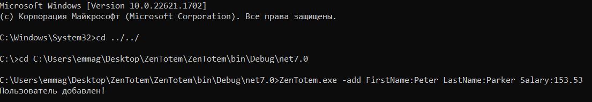

<h1>Иммитация CRUD API с фалом JSON</h1>

Rонсольное приложение, обрабатывающее текстовый файл, содержащий список сотрудников в формате JSON

Доступны следующие аргументы и операции:

1. -**add FirstName:John LastName:Doe Salary:100.50.**
Добавляет в файл новую запись.
2. **-update Id:123 FirstName:James**
Обновляет запись с Id=123, меняет в нем поле FirstName на указанное.
3. **-get Id:123**
Выводит в консоль строку формата «Id = {Id}, FirstName = {FirstName}, LastName = {LastName}, SalaryPerHour = {SalaryPerHour}», вместо {Id}, {FirstName}, {LastName}, {SalaryPerHour} должны быть подставлены соответствующие поля из записи с Id=123 из файла.
4. **-delete Id:123**
Удаляет запись с Id=123 из файла.
5. **-getall** Возвращает список всех сотрудников (формат аналогичен приведенному в описании аргумента -get).

Для изменения данных в JSON файле необходимо передавать аргументы призапуске приложения в следующем виде

